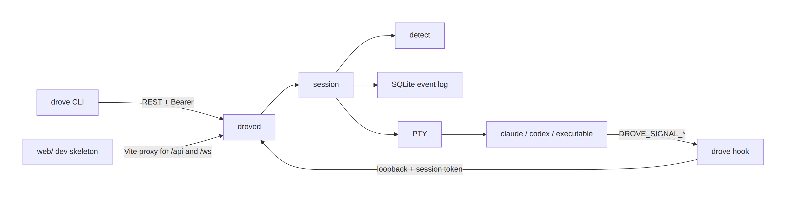

<p align="center"><a href="README.md">中文</a></p>

<p align="center">
  <picture>
    <source media="(prefers-color-scheme: dark)" srcset="docs/assets/logo-dark.svg">
    
  </picture>
</p>

<p align="center">
  <strong>A flight recorder and control tower for AI coding agents.</strong><br>
  Record every local terminal as replayable bytes, and mark Working, Blocked, Done, and Idle.
</p>

<p align="center">
  <a href="https://github.com/Duang777/drove/actions/workflows/ci.yml"></a>
  <a href="https://go.dev/dl/"></a>
  <a href="LICENSE"></a>
</p>

Drove is a local daemon and CLI. It starts Claude Code, Codex, or any executable in a real PTY, appends the raw terminal bytes to SQLite, and reports one shared set of states.

The recorder works today: `drove log` replays bytes. The tower grid, scrubbable timeline, push notifications, and phone approval are tracked by [Epic #31](https://github.com/Duang777/drove/issues/31) and have no UI yet. There is no release build and no TUI.

## Status

| Marker | Meaning |
| --- | --- |
| Shipped | Usable from `main` with the commands below |
| In progress | Partially merged; the issue is still open |
| Planned | No command or UI yet |

| Capability | Status | Where |
| --- | --- | --- |
| One PTY per agent, owned by `droved` | Shipped | `internal/pty` |
| `init` `up` `ps` `log` `stop` `send` `hook` `version` | Shipped | `cmd/drove` |
| Per-session Claude / Codex signal injection | Shipped | [#15](https://github.com/Duang777/drove/issues/15) |
| Raw terminal bytes, retained 30 days by default | Shipped | [#13](https://github.com/Duang777/drove/issues/13) |
| `drove log` byte replay, `--plain` strips control sequences | Shipped | |
| Loopback bind, local token for REST and WebSocket | Shipped | |
| WebSocket event stream and input frames with `request_id` | Shipped | |
| Web skeleton: list, start, stop, live events | Shipped | `web/` |
| Terminal emulation and screen rules | In progress | [#14](https://github.com/Duang777/drove/issues/14), [spec 010](specs/010-terminal-screen-detection/spec.md) |
| Replay timeline | Planned | [#25](https://github.com/Duang777/drove/issues/25) |
| Control-tower grid | Planned | [#26](https://github.com/Duang777/drove/issues/26) |
| Push notifications | Planned | [#27](https://github.com/Duang777/drove/issues/27) |
| Approve, deny, or reply from a phone | Planned | [#28](https://github.com/Duang777/drove/issues/28) |
| Native resume, and SIGTERM with a grace period before SIGKILL | Planned | [#16](https://github.com/Duang777/drove/issues/16) |
| Agent processes that survive daemon exit | Planned | [#17](https://github.com/Duang777/drove/issues/17), [#18](https://github.com/Duang777/drove/issues/18) |
| `drove attach`, a terminal UI, xterm.js | Planned | [#20](https://github.com/Duang777/drove/issues/20) |
| Away brief, cross-session search, git worktree | Planned | [#29](https://github.com/Duang777/drove/issues/29), [#30](https://github.com/Duang777/drove/issues/30), [#23](https://github.com/Duang777/drove/issues/23) |

## Architecture

<p>
  <picture>
    <source media="(prefers-color-scheme: dark)" srcset="docs/assets/architecture.en-dark.png">
    
  </picture>
</p>

The CLI is a short-lived client. Once started, `droved` owns the PTY. State and output are written to SQLite before they are published to WebSocket subscribers. Vendor-specific behavior stays in `internal/adapter`.

## Quick start

Go 1.24.2 or newer is required. PTYs use `github.com/creack/pty`, which builds on Linux and macOS. Windows is not supported. CI runs on Ubuntu with Go 1.24.2 and current stable. There are no release binaries; build from source. Keep `drove` and `droved` in the same directory: the CLI looks beside itself for the daemon, and the daemon looks beside itself for the hook relay.

```bash
git clone https://github.com/Duang777/drove.git
cd drove
make build
export PATH="$PWD/bin:$PATH"

drove init
drove up /bin/cat --name demo
drove ps
drove send <agent-id> 'hello'
drove log <agent-id>
drove log <agent-id> --plain
drove stop <agent-id>
drove version
```

`drove init` writes the default config to `~/.drove/config.json`. An existing file is overwritten. `data_dir` is the absolute path of `~/.drove`, created with mode `0700`.

`drove up` starts `droved` when nothing is listening. The daemon log is `<data_dir>/drove.log`. The `/bin/cat` example does not need Claude or Codex. Those vendors need their own CLIs on `PATH`:

```bash
drove up claude --name api --dir "$PWD"
drove up codex --oneshot
drove up claude --hooks required
```

### Commands

| Command | Behavior |
| --- | --- |
| `drove init` | Write the default `config.json`. Overwrites an existing file |
| `drove up <vendor\|command>` | Start a session. Vendor names are `claude` and `codex`. Any other string is an executable name, with no extra arguments |
| `drove ps` | Print AGENT ID, NAME, VENDOR, MODE, STATE, PID. Prints `no agents running` when empty |
| `drove log <agent-id>` | Write terminal bytes to stdout. Does not print state events |
| `drove log <agent-id> --plain` | Strip control sequences with a streaming filter |
| `drove send <agent-id> <text>` | Send that line plus a newline. Prints the byte count |
| `drove send <agent-id> --stdin` | Read stdin as-is, with no added newline |
| `drove stop <agent-id>` | Stop that session |
| `drove hook --vendor claude\|codex` | Used by the injected agent child. Reads one JSON document from stdin and exits 0 even when delivery fails |
| `drove version` | Print the version. `make build` fills it from `git describe`. Commit and build time stay `unknown` unless those ldflags are set |

Flags on `drove up`: `--name`, `--dir`, `--oneshot`, `--hooks off|auto|required`.

`drove send` accepts valid UTF-8 only, at most 64 KiB. The audit event stores the byte count, not the text. One `drove hook` JSON document is limited to 1 MiB. The hook command does not read the control token and does not start the daemon.

## How it works

### State

The state machine lives in `internal/agent`. Running sessions show `working`, `blocked`, `done`, and `idle`, plus the lifecycle states `pending`, `starting`, and `stopped`. `done` and `stopped` are terminal.

A per-session detector computes one decision. That decision is stored in SQLite, applied in memory, then broadcast. Sources apply in this order:

1. **Process.** Startup failure and exit override other signals. An interactive session ends as `stopped`. A successful `--oneshot` exit is `done`.
2. **Claude command hooks.** After the first valid hook signal is committed, that session is hook-authoritative. The event kind selects Working, Blocked, or an Idle candidate. Idle has a 1 second confirmation window that later activity can cancel.
3. **Codex notify.** This does not become hook authority and does not satisfy `--hooks required`. In fallback it is only a cancellable Idle candidate.
4. **Screen rules, in progress.** Before hooks activate, fallback uses screen rules. After hooks are active, the implementation allows only two screen writes: an approval prompt disappearing (Blocked → Working), and a Claude interrupt (Working → Idle). [#14](https://github.com/Duang777/drove/issues/14) is still open: there is no `drove explain`, and no acceptance fixtures or performance proof yet.

`--hooks auto` is the default for Claude and Codex. It waits 5 seconds, then enters fallback if no valid native hook arrived. In fallback, 60 seconds of output silence can become an Idle candidate. `--hooks off` does not inject a reporter. `--hooks required` stops the session as `stopped` if no valid native hook arrives within 5 seconds. generic cannot select `required`.

### Per-session injection

By default Drove only changes the process it starts. It does not edit `~/.claude`, `~/.codex`, or project config, and it does not accept workspace trust or hook trust for you.

- Claude Code: a hooks-only file is written to `<data_dir>/sessions/<agent-id>/claude-settings.json` with mode `0600`, in a `0700` directory, and loaded with `--settings`. The directory is removed after the process exits.
- Codex: `-c notify=[...]` is appended. No config file is written. notify only means a turn finished.

Both inherit `DROVE_AGENT_ID`, `DROVE_SIGNAL_URL`, and `DROVE_SIGNAL_TOKEN`. The signal endpoint accepts only loopback plus that session token. The event log does not store the raw payload, prompt, tool input, transcript, or token.

If the caller already passed Claude `--bare` or `--settings`, or a Codex `notify` setting, Drove leaves it alone and records the injection as skipped. If the `drove` relay cannot be found, `auto` still starts the session. Manual setup is in the [hook guide](docs/hooks.md). A persistent installer is [#24](https://github.com/Duang777/drove/issues/24) and is not implemented. Codex OSC 9 notifications are not injected either.

### Recording

New sessions store PTY output as `output.chunk` events with a byte offset. Older `output` line events remain readable; replay adds a newline to each of them. `drove log` keeps ANSI sequences and invalid bytes. Expired attachments produce no placeholder text.

Raw output is kept for 30 days by default. `0` keeps it indefinitely. Cleanup deletes byte attachments only. Sequence numbers, timestamps, offsets, and lengths stay. Cleanup enables SQLite `secure_delete` and truncates the WAL. It does not run `VACUUM`, so allocated database space may not shrink.

Once a database contains `output.chunk`, the oldest safe reader is [`d11f6c3`](https://github.com/Duang777/drove/commit/d11f6c3). After a version 3 screen signal is written, the oldest safe reader is [`f361ab5`](https://github.com/Duang777/drove/commit/f361ab5).

### Stop and restart

`drove stop`, and daemon shutdown on SIGINT or SIGTERM, both call `Process.Kill` (SIGKILL) on the PTY child. There is no SIGTERM grace period.

After `drove up` returns, the foreground command is gone and the session lives in `droved`. That daemon is not detached from the controlling terminal and does not handle SIGHUP. When the daemon exits, its agent processes do not remain.

On the next start the daemon rebuilds projections from the event log. Sessions whose PTY cannot be reattached are closed as `stopped` with `session interrupted by daemon restart; previous PTY is not reconnectable`. Bytes already stored can still be read with `drove log`. The live process does not come back.

Native `claude --resume` / `codex resume`, and a SIGTERM-then-grace-then-SIGKILL stop, are [#16](https://github.com/Duang777/drove/issues/16). A per-session shim that keeps the process across a daemon restart is [#17](https://github.com/Duang777/drove/issues/17) and [#18](https://github.com/Duang777/drove/issues/18).

## Supported agents

| Launch | Interactive | `--oneshot` | State signal |
| --- | --- | --- | --- |
| `drove up claude` | `claude` | `claude --print` | Per-session command hooks |
| `drove up codex` | `codex` | `codex exec` | Process-level notify; Idle only while in fallback |
| `drove up <executable>` | Runs that file with no extra arguments | Successful exit is `done` | No hooks, empty screen classifier, `--hooks required` is rejected |

ACP is not registered. `drove up acp` tries to execute a program named `acp`. It does not start an ACP adapter.

## Configuration

The config file is `~/.drove/config.json`. `DROVE_DATA_DIR` overrides `data_dir`. The daemon rejects an `api_bind` host that is not loopback.

```json
{
  "data_dir": "/home/you/.drove",
  "api_bind": "127.0.0.1:7373",
  "event_buffer": 1024,
  "console_origins": [
    "http://localhost:5173",
    "http://127.0.0.1:5173"
  ],
  "storage": {
    "output_retention_days": 30
  }
}
```

`agents.<vendor>.signal_injection` accepts only `auto` or `off`. That is the vendor default for injection. `off|auto|required` is the per-invocation `drove up --hooks` policy and is not stored in this field.

```json
{
  "agents": {
    "claude": {"signal_injection": "off"},
    "codex": {"signal_injection": "off"}
  }
}
```

The control token is 256 random bits, stored as lowercase hex in `<data_dir>/control.token` with mode `0600`. It is created the first time the daemon starts. The config file itself is mode `0644`.

## Web skeleton

The daemon does not serve the frontend. The Vite dev server proxies `/api` and `/ws` to `api_bind` and adds a Bearer token from `control.token`. Start the daemon first, or the token file does not exist yet:

```bash
drove ps
cd web
npm install
npm run dev
```

Open `http://127.0.0.1:5173`. The page can list, start, and stop sessions, and it shows the WebSocket event stream. An `output.chunk` row shows its offset and length, not a terminal. The class names on the page are not wired to a stylesheet. Replay bytes with `drove log`.

A live terminal, scrubbable replay, and the tower grid are [#20](https://github.com/Duang777/drove/issues/20) and [#26](https://github.com/Duang777/drove/issues/26). The approved direction for #20 is web first.

## Roadmap

The approved MVP is [Epic #31, flight recorder + control tower](https://github.com/Duang777/drove/issues/31).

1. [#14](https://github.com/Duang777/drove/issues/14) finishes the screen model, including `drove explain`
2. [#19](https://github.com/Duang777/drove/issues/19) WebSocket terminal stream
3. [#25](https://github.com/Duang777/drove/issues/25) replay timeline
4. [#20](https://github.com/Duang777/drove/issues/20) web live terminal and replay
5. [#26](https://github.com/Duang777/drove/issues/26) control-tower grid
6. [#21](https://github.com/Duang777/drove/issues/21) unix socket, Host checks, cookie, token rotation
7. [#27](https://github.com/Duang777/drove/issues/27) push and [#28](https://github.com/Duang777/drove/issues/28) approve / deny / reply from a phone
8. [#16](https://github.com/Duang777/drove/issues/16) native resume and a gentler stop

After the MVP: the shim in [#17](https://github.com/Duang777/drove/issues/17) / [#18](https://github.com/Duang777/drove/issues/18), then the away brief [#29](https://github.com/Duang777/drove/issues/29), full-text search [#30](https://github.com/Duang777/drove/issues/30), and worktrees [#23](https://github.com/Duang777/drove/issues/23). Structured state sources [#22](https://github.com/Duang777/drove/issues/22) and the persistent hook installer [#24](https://github.com/Duang777/drove/issues/24) are deferred.

## How this differs

Drove runs the vendor's own CLI and does not link a vendor SDK. What it offers today is a local event log, byte replay, and one set of state commands for Claude and Codex. It does not offer git worktrees, diff review, or a PR workflow.

[herdr](https://herdr.dev/) is a TUI-centered tool whose public positioning keeps terminals in a background server after the client closes. Drove stores raw bytes and state events in local SQLite. Keeping the process alive after the daemon exits is not what Drove does today. Single-vendor background sessions, phone approval, and the official apps each cover that vendor's own agent.

## Security

This is a single-user control plane on the local machine.

- `api_bind` must be loopback. Any other host is rejected while validating config.
- REST and WebSocket require `Authorization: Bearer`. The token comes from `control.token`. Comparison is constant-time.
- A WebSocket with no `Origin` is allowed, which is the CLI case. A single `Origin` must match `console_origins` exactly.
- `/signal` accepts only loopback and that session's token. It does not accept the control-plane token.
- Any process running as the same OS user can read the token file. The token does not defend against other local processes, or against the agent itself.
- Input audit does not store the text. Raw output may contain source and secrets; attachments are deleted after the default 30 days.
- Signal tokens in the output stream are redacted with an equal-length replacement.
- There is no auto-approve. Phone approval is [#28](https://github.com/Duang777/drove/issues/28), and the default there is still not automatic approval.

The design notes are in [RFC-001, security considerations](docs/rfc-001-agent-state-and-control.md). The repository does not have a separate threat-model document.

## Docs

| Doc | What it is |
| --- | --- |
| [Hook guide](docs/hooks.md) | Session injection and hand-written native hooks |
| [RFC-001](docs/rfc-001-agent-state-and-control.md) | State, input, and security design |
| [spec 006](specs/006-hook-backed-state-detection/spec.md) | Hook-backed state detection |
| [spec 008](specs/008-session-signal-injection/spec.md) | Per-session injection |
| [spec 009](specs/009-raw-output-chunks/spec.md) | Raw bytes and retention |
| [spec 010](specs/010-terminal-screen-detection/spec.md) | Screen detection, implementation in progress |
| [Technical notes](docs/technical-notes.md) | A point-in-time reading. Its opening says the first six sections are not current `main` |
| [AGENTS.md](AGENTS.md) | Directory responsibilities and engineering constraints |

## Contributing

Every directory has an `AGENTS.md`. The nearest one wins. Commit messages use Conventional Commits: `feat:`, `fix:`, `refactor:`, `docs:`, `test:`.

```bash
make test   # go test ./... -race, then a coverage summary
make vet
make lint   # gofmt + vet
```

Frontend checks:

```bash
npm --prefix web run typecheck
npm --prefix web run build
```

## License

[Apache-2.0](LICENSE).
