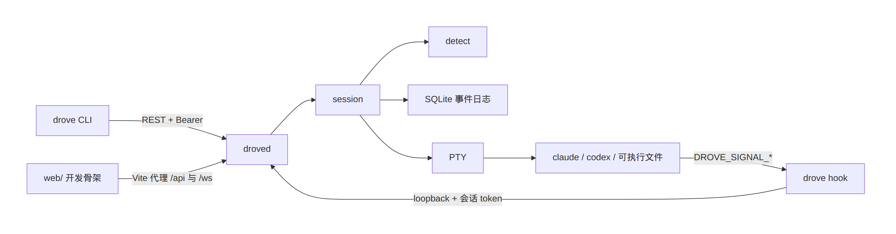

<p align="center"><a href="README.en.md">English</a></p>

<p align="center">
  <picture>
    <source media="(prefers-color-scheme: dark)" srcset="docs/assets/logo-dark.svg">
    
  </picture>
</p>

<p align="center">
  <strong>跨厂商 AI 编码 agent 的黑匣子与塔台。</strong><br>
  在本机把每一路终端录成可回放的字节，并标出 Working、Blocked、Done、Idle。
</p>

<p align="center">
  <a href="https://github.com/Duang777/drove/actions/workflows/ci.yml"></a>
  <a href="https://go.dev/dl/"></a>
  <a href="LICENSE"></a>
</p>

Drove 是一个本地 daemon 加 CLI。它在真实 PTY 里启动 Claude Code、Codex，或任何一个可执行文件，把终端字节追加进 SQLite，并用同一套状态看它们。

黑匣子是已经能用的部分：`drove log` 回放字节，`drove timeline` 查看状态区间和 Blocked 跳转点。塔台网格、时间线拖动、推送和手机审批在 [Epic #31](https://github.com/Duang777/drove/issues/31)，还没有界面。仓库没有发布包，也没有 TUI。

## 功能状态

| 标记 | 含义 |
| --- | --- |
| 已落地 | 当前 `main` 可以按下面的命令使用 |
| 进行中 | 代码已部分合入，对应 issue 仍打开 |
| 规划中 | 还没有可用的命令或界面 |

| 能力 | 状态 | 在哪里 |
| --- | --- | --- |
| 每个 agent 一个 PTY，由 `droved` 持有 | 已落地 | `internal/pty` |
| `init` `up` `resume` `ps` `log` `timeline` `explain` `stop` `send` `hook` `worktree` `web` `token rotate` `version` | 已落地 | `cmd/drove` |
| Claude / Codex 按会话注入状态上报 | 已落地 | [#15](https://github.com/Duang777/drove/issues/15) |
| 终端字节记录，默认保留 30 天 | 已落地 | [#13](https://github.com/Duang777/drove/issues/13) |
| `drove log` 回放字节，`--plain` 去掉控制序列 | 已落地 | |
| Unix 本地控制面、Host / Origin 防护、cookie 登录和令牌轮换 | 已落地 | [#21](https://github.com/Duang777/drove/issues/21) |
| WebSocket v1 事件流与 v2 按会话终端流、输入、resize | 已落地 | [#19](https://github.com/Duang777/drove/issues/19) |
| Web 开发骨架：列表、启动、停止、实时事件 | 已落地 | `web/` |
| 终端屏幕仿真、查询应答、屏幕规则和 `drove explain` | 已落地 | [#14](https://github.com/Duang777/drove/issues/14)，[spec 010](specs/010-terminal-screen-detection/spec.md) |
| Codex approval-only OSC 9 Blocked 候选 | 已落地 | [#40](https://github.com/Duang777/drove/issues/40)，[spec 012](specs/012-codex-osc9-notifications/spec.md) |
| 状态时间线、Blocked 跳转和精确终端帧 | 已落地 | [#25](https://github.com/Duang777/drove/issues/25) |
| 塔台网格 | 规划中 | [#26](https://github.com/Duang777/drove/issues/26) |
| 推送通知 | 规划中 | [#27](https://github.com/Duang777/drove/issues/27) |
| 手机上批准、拒绝或回一句 | 规划中 | [#28](https://github.com/Duang777/drove/issues/28) |
| 原生 resume，停止按进程组 SIGTERM 后宽限再 SIGKILL | 已落地 | [#16](https://github.com/Duang777/drove/issues/16) |
| 每个 agent 使用独立 Git worktree | 已落地 | [#23](https://github.com/Duang777/drove/issues/23) |
| daemon 退出后 agent 进程仍在 | 规划中 | [#17](https://github.com/Duang777/drove/issues/17)、[#18](https://github.com/Duang777/drove/issues/18) |
| `drove attach`、终端 UI、xterm.js | 规划中 | [#20](https://github.com/Duang777/drove/issues/20) |
| 离开简报、跨会话搜索 | 规划中 | [#29](https://github.com/Duang777/drove/issues/29)、[#30](https://github.com/Duang777/drove/issues/30) |

## 架构

<p>
  <picture>
    <source media="(prefers-color-scheme: dark)" srcset="docs/assets/architecture-dark.png">
    
  </picture>
</p>

CLI 是短命令。`droved` 被自动拉起后一直持有 PTY。状态和输出先写入 SQLite，再经 Hub 推给 WebSocket 订阅者。厂商差异只在 `internal/adapter`。

每个 attached 会话还有一个 terminal actor。它只接收已经写入 SQLite 并发布到
Hub 的输出块，再更新私有终端屏幕。终端查询应答直接写回同一个 PTY，不进入输出
事件或用户输入审计。

## 快速开始

需要 Go 1.24.2 或更高版本。PTY 依赖 `github.com/creack/pty`，在 Linux 和 macOS 上构建；Windows 不在支持范围内。CI 在 Ubuntu 上跑 Go 1.24.2 和当前 stable。仓库还没有 release，请从源码构建。`drove` 和 `droved` 必须放在同一目录：CLI 在旁边找 daemon，daemon 在旁边找 hook relay。

```bash
git clone https://github.com/Duang777/drove.git
cd drove
make build
export PATH="$PWD/bin:$PATH"

drove init
drove up /bin/cat --name demo
drove ps
drove send <agent-id> 'hello'
drove log <agent-id>
drove log <agent-id> --plain
drove timeline <agent-id>
drove explain <agent-id>
drove stop <agent-id>
drove web
drove version
```

`drove init` 把默认配置写到 `~/.drove/config.json`。文件已存在时会覆盖。`data_dir` 写成主目录下 `.drove` 的绝对路径，目录权限是 `0700`。

`drove up` 在 daemon 没在听的时候拉起 `droved`。日志在 `<data_dir>/drove.log`。上面的 `/bin/cat` 不需要安装 Claude 或 Codex，用来确认链路。Claude Code 和 Codex 需要它们自己的 CLI 已在 `PATH` 里：

```bash
drove up claude --name api --dir "$PWD"
drove up codex --oneshot
drove up claude --hooks required
drove up claude --worktree --branch feature/api
```

### 命令

| 命令 | 行为 |
| --- | --- |
| `drove init` | 写入默认 `config.json`。已存在则覆盖 |
| `drove up <vendor\|command>` | 启动一个会话。厂商名是 `claude`、`codex`；其他字符串当作可执行文件名，不能再跟参数 |
| `drove resume <agent-id>` | 对可恢复的 Claude / Codex 会话执行厂商原生 resume，保留 Agent ID |
| `drove ps` | 打印 AGENT ID、NAME、VENDOR、MODE、STATE、PID、RESUMABLE。没有会话时打印 `no agents running` |
| `drove log <agent-id>` | 只把终端字节写到 stdout。不打印状态事件 |
| `drove log <agent-id> --plain` | 用流式清洗器去掉控制序列 |
| `drove timeline <agent-id>` | 打印状态区间、输出保留范围和一基 Blocked 跳转点。`--json` 输出完整响应 |
| `drove explain <agent-id>` | 打印最近的状态决策和 attached 会话的临时受限屏幕 |
| `drove send <agent-id> <text>` | 发送这一行并自动加上换行。stdout 打印字节数 |
| `drove send <agent-id> --stdin` | 原样读取标准输入，不追加换行 |
| `drove stop <agent-id>` | 停止该会话 |
| `drove hook --vendor claude\|codex` | 给被注入的 agent 子进程用。从 stdin 读一份 JSON，失败也返回 0 |
| `drove worktree ls` | 列出 Drove 创建的 worktree、分支和 dirty 状态 |
| `drove worktree rm <agent-id>` | 删除 clean worktree，保留分支。`--force` 允许丢弃未提交更改 |
| `drove web` | 经 Unix socket 签发一次性登录码并打开内嵌 Web 控制台 |
| `drove token rotate` | 原子轮换控制令牌，不打印令牌值 |
| `drove version` | 打印版本。`make build` 用 `git describe` 填版本号；commit 和构建时间未注入时是 `unknown` |

`drove up` 的标志：`--name`、`--dir`、`--oneshot`、
`--hooks off|auto|required`、`--worktree`、`--branch`。

`drove send` 只接受合法 UTF-8，单次最多 64 KiB。审计事件只记字节数，不记正文。`drove hook` 的单份 JSON 上限是 1 MiB。它不读取控制令牌，也不会拉起 daemon。

## 工作原理

### Git worktree

`drove up <vendor> --worktree` 从 `--dir` 指定的仓库创建独立分支和 worktree。
没有 `--dir` 时使用调用 CLI 时的当前目录；没有 `--branch` 时分支名是
`drove/<agent-id>`。worktree 位于
`<data_dir>/worktrees/<repo-hash>/<agent-id>`，Agent 进程直接在这个目录启动。

仓库根目录存在 `.worktreeinclude` 时，Drove 按 gitignore 语义把匹配的未跟踪文件
复制到新 worktree，例如 `.env` 或本地证书。没有匹配的未跟踪文件不会复制。创建
事件在 SQLite 中私有记录仓库、worktree 路径和分支；REST、WebSocket 和公开回放
会删除这些字段。

会话退出后 worktree 不会自动删除。`drove worktree rm` 默认拒绝 dirty worktree；
`--force` 只允许删除含未提交更改的目录。两种方式都保留分支，Drove 不自动 merge、
rebase、push 或删除分支。

### 状态

状态机在 `internal/agent`。运行中会看到 `working`、`blocked`、`done`、`idle`，另外有生命周期状态 `pending`、`starting`、`stopped`。`done` 和 `stopped` 是终态。

一次决定由会话里的 Detector 算出，先写入 SQLite，再更新内存，最后广播。来源按这个顺序生效：

1. **进程。** 启动失败和退出覆盖其他信号。交互会话结束为 `stopped`。`--oneshot` 成功退出为 `done`。
2. **Claude command hook。** 第一个合法 hook 信号提交后，该会话进入 hook 权威。进入 Working、Blocked 或 Idle 候选由事件种类决定。Idle 有 1 秒确认窗口，后续活动可以取消它。
3. **Codex notify 与 OSC 9。** legacy notify 只在 fallback 里作为可取消的 Idle 候选；approval-only OSC 9 只在 fallback 中作为需要 750 ms 确认的 Blocked 候选。两者都不进入 hook 权威，也不满足 `--hooks required`。
4. **屏幕规则。** hook 还没激活时，fallback 使用 Claude 和 Codex 的稳定屏幕规则。hook 已经激活时，只允许两类屏幕信号改变状态：审批框消失（Blocked → Working），以及 Claude 中断（Working → Idle）。其他屏幕边沿仍写入事件日志，但结果是 `suppressed`。

`--hooks auto` 是 Claude 和 Codex 的默认值，等待 5 秒。没有合法原生 hook 就进入 fallback。fallback 里，输出静默 60 秒可以成为 Idle 候选。`--hooks off` 不注入上报。`--hooks required` 在 5 秒内没有合法原生 hook 时把会话停为 `stopped`。generic 不能选 `required`。

### 终端屏幕与解释

每个 attached 会话有一个 terminal actor。它独占固定版本的
`github.com/charmbracelet/x/vt`、厂商分类器、100 ms 固定采样计时器和当前不可变
快照。输出必须先写入 SQLite，再更新内存投影并发布到 Hub。只有这次提交返回的
offset、最终事件序号和提交时间才能随字节进入 terminal actor。

x/vt 生成的 DSR、OSC 10/11、DA1 和 Kitty keyboard 查询应答直接调用
`pty.Session.Write`。这个调用与用户输入共用 PTY 的完整帧写锁，但不经过
`Manager.SendInput`，因此不会产生 `agent.input`。reply 也不会进入输出事件、
回放、快照或 explain。子进程自己回显 reply 时，那份回显才是普通 PTY 输出。

屏幕事件只保存稳定规则名、边沿、区域、静态 evidence、输出 offset 和最终输出
序号。事件不保存匹配文本、屏幕行或屏幕 hash。用以下命令查看这些决策：

```bash
drove explain <agent-id>
drove explain <agent-id> --limit 20
drove explain <agent-id> --json
```

attached 会话最多返回底部 12 行，每行最多 160 个 cells，编码后最多 4 KiB。
输出处理器会等长打码当前会话的 signal token，但快照没有通用密钥扫描。屏幕可能
包含源码、prompt 或凭据，只在当前进程 attached 时临时返回。进程 detach 后，
`explain` 只返回持久化的脱敏决策。

WebSocket v2 提供按会话的 raw、events 和 snapshot 订阅，以及 writable raw
attachment 的 input 和 resize。它是协议和客户端能力，不是交互界面。Web attach
和终端 UI 仍由 [#20](https://github.com/Duang777/drove/issues/20) 跟踪。32
会话实测结果见
[技术笔记](docs/technical-notes.md#9-terminal-actor-32-session-benchmark)。

### 终端流

连接 `/ws` 时不发送子协议，行为仍是 v1 全局事件流。发送
`Sec-WebSocket-Protocol: drove.v2` 才启用按 Agent 的 raw、events 和 snapshot
订阅。显式发送其他子协议会在 upgrade 前得到 400。

v2 cursor 包含最后消费的全局事件序号 `seq` 和下一个未消费的会话输出字节
`next_offset`。两者在 JSON 中都是十进制字符串。客户端只在成功处理消息后推进
cursor；重连时把完整 cursor 传回 subscribe，服务端从 SQLite 继续发送，不依赖
可能丢事件的 Hub。

有效 resize 与输出由同一个会话 actor 排序。Drove 先调整 PTY 和 x/vt，再写入
`agent.resized`。每个连接有 8 MiB 出站预算。连接跟不上时，服务端返回
`slow_consumer` 和最后成功写出的 cursor，再以 1013 关闭；其他连接和事件提交不受
这个连接阻塞。

snapshot 是 live-only 预览，每个 attachment 最多每 500 ms 一帧。未读帧会被新帧
替换，响应始终带 `restorable:false`。snapshot 不进入 Hub 或 SQLite，不能作为
精确回放起点。

### 会话级注入

默认只改 Drove 启动的那个进程，不改 `~/.claude`、`~/.codex` 或项目配置，也不代替你接受 workspace trust 或 hook trust。

- Claude Code：在 `<data_dir>/sessions/<agent-id>/claude-settings.json` 写入仅含 hooks 的临时文件，权限 `0600`，目录 `0700`，用 `--settings` 加载。进程退出后删除该目录。
- Codex：原子追加 legacy `notify` 与 approval-only OSC 9 的四个 `-c` 配置，不写配置文件。notify 只表示一轮结束；OSC 9 只提供等待审批的 Blocked 候选。

两者都继承 `DROVE_AGENT_ID`、`DROVE_SIGNAL_URL`、`DROVE_SIGNAL_TOKEN`。signal 端点只接受 loopback 和这个会话 token。事件日志不保存原始 payload、prompt、tool input、transcript 或 token。

调用方自己带了 Claude `--bare`、`--settings`，或 Codex 的 `notify`、`tui.notifications`、`tui.notification_method`、`tui.notification_condition` 时，Drove 不覆盖，并把整组 Codex 注入记为跳过。找不到 `drove` relay 时，`auto` 仍会启动。手工配置见 [状态 hook 配置指南](docs/hooks.md)。持久安装器在 [#24](https://github.com/Duang777/drove/issues/24)，尚未实现。

### 记录

新会话把 PTY 输出写成带字节偏移的 `output.chunk`。旧库里的 `output` 行事件仍可读，回放时每行补一个换行。`drove log` 默认保留 ANSI 和无效字节。唯一的协议级例外是 Drove 完整注入的 Codex OSC 9：分类前缀保留，command、path、server name 等自由文本在持久化前等长替换为 `*`。过期附件不打印占位文本。

`GET /api/v1/agents/{id}/timeline` 从事件 envelope 投影半开状态区间、输出保留
范围和 Blocked 次数。`GET /api/v1/agents/{id}/timeline/blocked/{number}` 返回
指定 Blocked 区间及提前 30 秒的 jump cursor。
`GET /api/v1/agents/{id}/frame` 必须且只能带 `seq`、`at` 或 `offset` 中的一个，
并从 40x120 原点按序回放 output 和 resize。CLI 当前只暴露 timeline，终端播放
留给 #20。

原始输出默认保留 30 天。设为 `0` 表示永久保留。清理只删除字节附件，事件序号、时间、offset 和长度都留着。清理打开 SQLite `secure_delete` 并截断 WAL，不执行 `VACUUM`，所以库文件已经占住的空间可能不缩小。

附件过期后 timeline 仍可读，并标记缺失区间。需要缺失字节的 frame 返回 HTTP
410、`output_expired` 和具体范围。精确 frame 使用 64 项内存 LRU；缓存按输出保留
代次失效。50 MiB 冷回放仍明显慢于 300 ms 目标，数据和后续工作见
[技术笔记](docs/technical-notes.md#11-terminal-stream-and-replay) 与
[#35](https://github.com/Duang777/drove/issues/35)。

数据库里一旦有 `output.chunk`，可回滚的最低提交是 [`d11f6c3`](https://github.com/Duang777/drove/commit/d11f6c3)。屏幕证据 version 3 写出之后，可回滚的最低提交是 [`f361ab5`](https://github.com/Duang777/drove/commit/f361ab5)。

### 停止和重启

`drove stop` 以及 daemon 收到 SIGINT / SIGTERM 后的关闭，都先向 PTY 的整个
进程组发送 SIGTERM。默认等待 5 秒；进程组仍存在时发送 SIGKILL。直接子进程被
回收后才关闭 PTY master，并等待尾部输出和退出回调完成。

`drove up` 返回之后，前台命令已经结束，会话挂在 `droved` 上。这个 daemon 没有脱离控制终端，也不处理 SIGHUP。daemon 退出后不会留下 agent 进程。

daemon 再次启动时从事件日志恢复投影。无法重连的旧会话先被收口为 `stopped`，
原因是 `session interrupted by daemon restart; previous PTY is not
reconnectable`。已经写下的字节还在，可以用 `drove log` 看。

Claude / Codex 的合法原生信号会保存一个私有恢复引用。停止后 `drove ps` 的
`RESUMABLE` 为 `true` 时，`drove resume <agent-id>` 分别执行
`claude --resume` 或 `codex resume`，继续使用原 Agent ID 和追加式事件流。引用
不会出现在 Status、公开 API 事件、CLI、日志或公开回放中。创建会话时的绝对工作
目录同样只写入私有事件载荷；原生恢复从该目录启动，避免厂商 CLI 在 daemon
工作目录变化后找不到原会话。

`session.auto_resume_on_start` 默认关闭。开启后，daemon 会在 API 已开始接受连接后，
按创建时间恢复重启前处于非终态且已有引用的会话；用户主动停止的会话不会自动恢复。
原进程跨 daemon 重启继续存活仍属于 [#17](https://github.com/Duang777/drove/issues/17)
和 [#18](https://github.com/Duang777/drove/issues/18)。

## 支持的 agent

| 启动 | 交互模式 | `--oneshot` | 状态信号 |
| --- | --- | --- | --- |
| `drove up claude` | `claude` | `claude --print` | 会话级 command hooks |
| `drove up codex` | `codex` | `codex exec` | legacy notify 提供 Idle 候选；approval-only OSC 9 提供 Blocked 候选 |
| `drove up <可执行文件>` | 直接执行该文件，没有额外参数 | 成功退出为 `done` | 无 hook，屏幕分类器为空，不能 `--hooks required` |

ACP 没有注册。`drove up acp` 会去执行一个名叫 `acp` 的程序，而不是 ACP 适配器。

## 配置

配置文件是 `~/.drove/config.json`。`DROVE_DATA_DIR` 覆盖 `data_dir`。daemon 拒绝非 loopback 的 `api_bind`。

```json
{
  "data_dir": "/home/you/.drove",
  "api_bind": "127.0.0.1:7373",
  "disable_tcp": false,
  "event_buffer": 1024,
  "console_origins": [
    "http://localhost:5173",
    "http://127.0.0.1:5173"
  ],
  "storage": {
    "output_retention_days": 30
  },
  "session": {
    "auto_resume_on_start": false,
    "termination_grace_seconds": 5
  }
}
```

`disable_tcp=true` 会关闭浏览器 listener，但 Unix socket 与 CLI 仍可用；此时
`drove web` 会直接报错。

`agents.<vendor>.signal_injection` 只接受 `auto` 或 `off`。这是厂商默认注入开关。`off|auto|required` 是单次 `drove up --hooks` 的会话策略，不写在这个字段里。

```json
{
  "agents": {
    "claude": {"signal_injection": "off"},
    "codex": {"signal_injection": "off"}
  }
}
```

控制令牌是 256 位随机值，十六进制写在 `<data_dir>/control.token`，权限 `0600`。首次启动 daemon 时生成。配置文件本身是 `0644`。

## Web 控制台

daemon 内嵌并同源托管生产前端。运行下面的命令会经 Unix socket 签发一次性登录码，
再打开带 fragment 的本地地址。页面兑换 HttpOnly、SameSite=Strict cookie 后会清除
fragment；浏览器 JavaScript 不读取 `control.token`。

```bash
drove web
```

页面可以列出、启动、停止会话，并显示 WebSocket 事件。`output.chunk` 只显示 offset 和
长度，不画终端。回放字节仍用 `drove log`。

前端开发服务器继续把 `/api` 和 `/ws` 代理到 daemon，并由 Vite 进程读取控制令牌：

```bash
drove ps
cd web
npm install
npm run dev
```

`npm run build` 把生产资源写入并更新 `internal/webui/dist/`。生成资源需要与前端源码一同
提交，保证只安装 Go 工具链的干净 checkout 也能构建完整 daemon。
打开 `http://127.0.0.1:5173`。页面可以列出、启动、停止会话，并显示 WebSocket
事件。仓库已有严格解码 `drove.v2` 的浏览器客户端，但页面尚未接入它。
`output.chunk` 只显示 offset 和长度，不画终端。回放字节用 `drove log`。

实时终端、回放拖动和塔台网格属于 [#20](https://github.com/Duang777/drove/issues/20) 和 [#26](https://github.com/Duang777/drove/issues/26)。产品方向把 #20 定为 Web 优先。

## 路线图

已批准的 MVP 是 [Epic #31：黑匣子 + 塔台](https://github.com/Duang777/drove/issues/31)。

屏幕模型、WebSocket 终端流、回放时间线和控制面加固已经完成，下一步是：

1. [#20](https://github.com/Duang777/drove/issues/20) Web 实时终端与回放
2. [#26](https://github.com/Duang777/drove/issues/26) 塔台网格
3. [#27](https://github.com/Duang777/drove/issues/27) 推送，[#28](https://github.com/Duang777/drove/issues/28) 手机上的批准 / 拒绝 / 回复
4. [#35](https://github.com/Duang777/drove/issues/35) 大型录制的精确 x/vt checkpoint

MVP 之后是 [#17](https://github.com/Duang777/drove/issues/17) / [#18](https://github.com/Duang777/drove/issues/18) 的 shim，然后是 [#29](https://github.com/Duang777/drove/issues/29) 离开简报和 [#30](https://github.com/Duang777/drove/issues/30) 全文搜索。[#22](https://github.com/Duang777/drove/issues/22) 结构化状态源和 [#24](https://github.com/Duang777/drove/issues/24) 持久 hook 安装器推迟。

## 和其他工具的差别

Drove 跑的是厂商自己的 CLI，不接它们的私有 SDK。它现在提供本地事件日志、字节回放、独立 Git worktree，以及 Claude 与 Codex 共用的状态命令。它不提供 diff 审阅或 PR 流程，也不自动合并 worktree 分支。

[herdr](https://herdr.dev/) 以 TUI 为中心，公开定位是关掉客户端后由后台 server 继续持有终端。Drove 把终端字节和状态事件留在本机 SQLite 里。daemon 退出后进程仍在，不是 Drove 今天的行为。单厂商的后台会话、手机审批和官方 App，各自只覆盖自己的 agent。

## 安全

这是一个单用户、本机控制面。

- `api_bind` 必须是 loopback。非 loopback 地址在配置校验时被拒绝。
- CLI 默认经 `<data_dir>/run/droved.sock` 调用 daemon；socket 目录为 `0700`，socket
  为 `0600`，Darwin / Linux 会拒绝不同 UID 的 peer。
- 浏览器只使用 loopback TCP。所有请求先精确校验 Host；携带 Origin 的请求必须精确
  匹配允许列表，cookie 认证的写请求和 WebSocket 不允许缺少 Origin。
- 控制 API 接受 `control.token` Bearer 或 HttpOnly cookie。`drove token rotate` 原子
  替换令牌，上一代只在 30 秒宽限期内有效，已有 WebSocket 随后收到 policy close。
- 静态前端和一次性登录兑换无需既有 cookie；兑换端点强制 Origin，登录码使用一次即
  失效。
- `/signal` 只接受 loopback 和该会话的 token，不接受控制面令牌。
- 同一 OS 用户能读到令牌文件。令牌不防本机上的其他进程，也不防 agent 自己。
- 输入审计不保存正文。原始输出可能含有源码和密钥，默认 30 天后删除附件。
- 输出流里的 signal token 会按等长方式打码。
- 完整注入的 Codex OSC 9 只保留固定审批分类前缀，所有自由文本在 Store、Hub、回放和 raw tail 之前等长打码。
- `drove explain` 的 live screen 没有通用密钥扫描，只在会话 attached 时返回。
- 没有自动批准。手机上的批准动作在 [#28](https://github.com/Duang777/drove/issues/28)，默认也不会自动同意。

设计说明在 [RFC-001 的安全考虑](docs/rfc-001-agent-state-and-control.md)。仓库没有单独的威胁模型文件。

## 文档

| 文档 | 内容 |
| --- | --- |
| [状态 hook 配置指南](docs/hooks.md) | 会话注入和手工原生 hooks |
| [RFC-001](docs/rfc-001-agent-state-and-control.md) | 状态、输入和安全设计 |
| [spec 006](specs/006-hook-backed-state-detection/spec.md) | hook 状态检测 |
| [spec 008](specs/008-session-signal-injection/spec.md) | 按会话注入 |
| [spec 009](specs/009-raw-output-chunks/spec.md) | 原始字节与保留期 |
| [spec 010](specs/010-terminal-screen-detection/spec.md) | 屏幕检测、查询应答和解释命令 |
| [spec 011](specs/011-terminal-stream-replay/spec.md) | 终端流、cursor、时间线和精确帧 |
| [spec 012](specs/012-codex-osc9-notifications/spec.md) | Codex approval OSC 9 检测与正文打码 |
| [技术笔记](docs/technical-notes.md) | 阶段性阅读笔记。文首说明前六节不代表当前主干 |
| [AGENTS.md](AGENTS.md) | 目录职责和工程约束 |

## 参与贡献

每个目录有自己的 `AGENTS.md`，以最近的一份为准。提交说明使用 Conventional Commits：`feat:`、`fix:`、`refactor:`、`docs:`、`test:`。

```bash
make test   # go test ./... -race，并打印覆盖率摘要
make vet
make lint   # gofmt + vet
```

前端类型检查和构建：

```bash
npm --prefix web run typecheck
npm --prefix web run build
```

## 许可

[Apache-2.0](LICENSE)。
