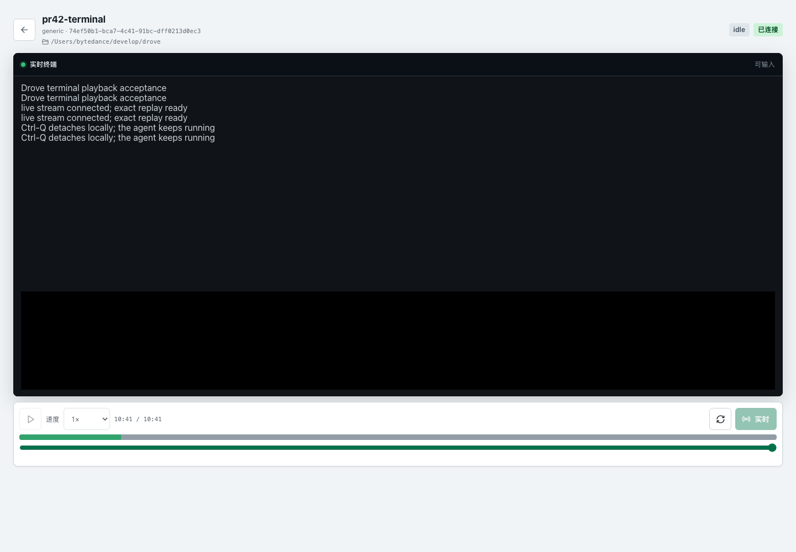
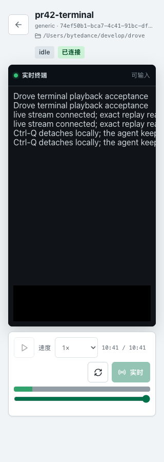

# Drove 技术笔记

本文记录以提交 `50214ba` 为起点的阶段性代码阅读，并补充后续重启安全改动的
验证证据。前六节保留当时发现的问题，不代表当前主干状态。当前能力见
[`README.md`](../README.md)、[RFC-001](rfc-001-agent-state-and-control.md) 和
[状态 hook 配置指南](hooks.md)。

## 1. 痛点与目标

Drove 想解决的问题是：多个 coding agent 各自在终端里运行，用户缺少统一的启动、观察、状态判断和历史回放入口。

项目选择了一个本地 control plane：

- `droved` 常驻并管理 agent 子进程。
- `drove` 通过 HTTP 调用 daemon。
- React 控制台通过 REST 和 WebSocket 展示状态与事件。
- 每个 agent 运行在 PTY 中，Drove 不接入厂商私有 SDK。
- 状态变化和输出转换成事件，先写 SQLite，再广播给实时订阅者。

这个方向适合本地开发工具。厂商差异被限制在 adapter 包中，核心会话模型不依赖 Claude Code 或 Codex 的 SDK。

## 2. 当前完成度

当前仓库仍处于初始 MVP 阶段。

### 已经实现

- 两个可编译的 Go 二进制：`drove` 和 `droved`。
- Agent 状态机及合法迁移表。
- Claude、Codex 和 generic 三类 adapter。
- PTY 子进程启动、带 offset 的原始字节块读取、写入和关闭。
- SQLite 追加式事件日志及按 session 回放。
- `output.chunk` envelope 与可过期 BLOB 附件原子写入；旧 `output` 行事件仍可读取。
- CLI 支持原始终端字节和 `--plain` 清洗回放，输出附件默认保留 30 天。
- daemon 启动时从 SQLite 事件流恢复历史会话，并从提交后的最大序号继续分配。
- 无法重连 PTY 的历史会话会追加恢复事件并收口为 `stopped`。
- 新会话会先持久化名称、厂商和运行模式，再进入状态机。
- runner 支持 `interactive` 和 `oneshot`；新请求默认 interactive，旧事件缺少模式时按 oneshot 恢复。
- Claude 与 Codex 的交互命令和单次执行命令由 adapter 统一选择。
- REST 和 CLI 支持向已连接 PTY 发送受限 UTF-8 输入，输入正文不会写入审计事件。
- oneshot 自然成功退出为 `done`；interactive、失败退出和主动停止为 `stopped`。
- PTY 输出与退出回调在 goroutine 启动前固定，短进程不会越过 `starting -> working`。
- daemon 按 API、会话、Hub、store 的依赖顺序关闭，并等待 PTY 回调结束。
- REST 管理接口和 WebSocket 实时事件流。
- CLI 的 `init`、`up`、`ps`、`log`、`stop`、`version` 命令。
- daemon 内嵌的 React 控制台、同源 cookie 登录、REST 客户端和 WebSocket 自动重连。

### 尚未形成完整产品闭环

- 没有可用的交互式 TUI。代码使用 Cobra，不包含 Bubble Tea 依赖。
- WebSocket 输入控制已接通；终端 attach 和 resize 端点尚未实现。
- Web 控制台没有可达的回放入口。
- ACP 仍是文档中的预留项。
- CI 只验证 Go，不验证 Web 构建或类型检查。

## 3. 实际架构

```text
CLI: cmd/drove
      |
      v
internal/client
      |
      | HTTP
      v
internal/api  <--------------------------- web/
      |                                     | REST
      |                                     | WebSocket
      v                                     |
internal/session.Manager -------------------+
      |
      +--> internal/adapter --> vendor command
      |
      +--> internal/pty ------> child process
      |
      +--> internal/agent ----> state machine
      |
      +--> internal/store ----> SQLite event log
      |
      +--> internal/event ----> live subscribers
```

`internal/session.Manager` 是当前实现的中心。它持有 agent、PTY session、adapter registry、event hub 和 store。

### 启动链路

`POST /api/v1/agents` 最终调用 `Manager.Start`：

1. 校验 `mode`，空值默认 `interactive`。
2. 根据 `vendor` 查找 adapter，并解析对应模式的命令。
3. 使用请求中的自定义命令覆盖 adapter 默认命令。
4. 创建 `agent.Agent`，初始状态为 `pending`。
5. 写入包含名称、厂商和模式的 `session_lifecycle(created)` 事件。
6. 迁移到 `starting`，状态事件写入 SQLite。
7. 使用固定的输出与退出回调启动 PTY 和子进程。
8. 登记 PTY，迁移到 `working`，再放行回调。
9. 返回包含运行模式的 `session.Status`。

关键代码：

- [`internal/api/server.go`](../internal/api/server.go)
- [`internal/session/session.go`](../internal/session/session.go)
- [`internal/pty/pty.go`](../internal/pty/pty.go)
- [`internal/adapter/adapter.go`](../internal/adapter/adapter.go)

### 事件链路

每次状态变化或输出到达时，`Manager.persistAndPublish` 执行：

```go
ev.Seq = m.hub.NextSeq()
store.AppendEvent(ev)
hub.Publish(ev)
```

设计意图是先落库，再广播。REST 回放查询 SQLite，WebSocket 消费 Hub 的实时事件。

关键代码：

- [`internal/session/session.go`](../internal/session/session.go)
- [`internal/event/event.go`](../internal/event/event.go)
- [`internal/store/store.go`](../internal/store/store.go)

### 状态模型

状态机包含：

```text
pending -> starting -> working
                         |
                         +--> blocked -> working
                         +--> done
                         +--> idle -> working / done

任意运行态最终进入 stopped
```

adapter 只返回 `StateHint`。`Manager` 决定是否执行迁移。这个边界是合理的，但当前 `Confidence` 字段没有参与决策。

### Web 数据链路

前端每 5 秒调用一次 `GET /api/v1/agents`，同时订阅 `/ws`。实时事件只用于本地状态投影，daemon 的列表响应仍是权威状态。

这套双轨模型能容忍 WebSocket 丢事件，但当前前端没有运行时 schema 校验。除 `hello` 消息外，任意 JSON 都会被直接断言成 `Event`。

## 4. 已验证的基线

本地环境：

- Go `1.24.13`
- Node `24.16.0`
- npm `11.13.0`
- macOS arm64

验证结果：

| 命令 | 结果 |
| --- | --- |
| `make build` | 通过，生成两个二进制 |
| `make vet` | 通过 |
| `make test` | 通过，启用 race detector |
| Go 总覆盖率 | 19.8% |
| `npm ci` | 通过，0 个已知漏洞 |
| `npm run typecheck` | 通过 |
| `npm run build` | 通过 |

Go 覆盖率集中在 `agent`、`event`、`adapter` 和 `store`。以下主链路包的覆盖率都是 0%：

- `session`
- `pty`
- `api`
- `client`
- `daemon`
- 两个 `cmd`

前端没有测试，也没有进入 GitHub Actions。

## 5. 实测发现

### 已修复：daemon 重启后事件持久化中断

测试过程：

1. 使用隔离数据目录启动 daemon。
2. 运行两个 generic 短命令。
3. 确认 SQLite 中有序号 1 到 7 的事件。
4. 正常停止并使用同一数据目录重启 daemon。
5. 再启动一个 generic 短命令。

结果：

- 历史事件仍可通过已知 session ID 回放。
- `GET /api/v1/agents` 在重启后返回空数组。
- 新 agent 能运行，状态也会变为 `stopped`。
- 新 session 的回放结果是 `null`。
- SQLite 仍只有原来的 7 条事件。

根因是 `event.NewHub()` 每次从序号 0 开始，而 daemon 没有读取 `Store.LastSeq()`。新事件再次使用序号 1，SQLite 主键冲突。`persistAndPublish` 吞掉持久化错误，只向实时 Hub 发布一个 error 事件。

修复后 `event.NewHub(initialSeq)` 显式接收当前序号。daemon 在创建 Manager 和 API listener 之前读取 `Store.LastSeq()`，读取失败则终止启动，不会退回序号 0。

回归验证使用隔离数据目录和同一个 SQLite 文件：

1. 第一次启动 daemon 后运行一个 generic 短命令，数据库写入序号 1 到 3。
2. 停止并重启 daemon。
3. 再运行一个 generic 短命令，新会话成功回放序号 4 到 6。
4. SQLite 最终包含 6 条连续事件，`MIN(seq)=1`，`MAX(seq)=6`。

单元测试同时覆盖空库从 1 开始、有历史时从 42 续接，以及最大序号读取失败时返回带 daemon 和 store 上下文的错误。

修复后的验证结果：

| 命令 | 结果 |
| --- | --- |
| `go test ./internal/event ./internal/daemon -race` | 通过 |
| `go test ./... -race` | 通过 |
| `go vet ./...` | 通过 |
| `make build` | 通过，生成 `bin/drove` 与 `bin/droved` |
| 隔离数据目录两次启动回归 | 通过，重启前最大序号 3，重启后新会话序号为 4 到 6 |

### 已修复：daemon 重启后会话投影丢失

daemon 现在会在创建 API server 和监听端口前完成以下步骤：

1. 按全局序号流式扫描 SQLite 事件。
2. 重建每个 session 的名称、厂商、状态、错误和时间。
3. 将当前 daemon 无法控制的历史非 stopped 会话追加为 stopped。
4. 在一个事务中提交全部 reconciliation 事件。
5. 用提交后的最大序号创建 Hub，再构造对外 API。

旧数据库没有 `created` 事件时，恢复结果使用完整 Agent ID 作为名称，并将厂商标记为 `unknown`。只有 output 或 error、没有生命周期或状态事实的 session 不会出现在状态列表中。坏状态链、坏元数据和未知事件类型会阻止 daemon 监听端口。

三次启动回归使用隔离数据目录 `/tmp/drove-three-start.6H6Kar`：

1. 第一次启动创建一个 1 秒短任务和一个仍在运行的任务。短任务正常 stopped，长任务保持 working，SQLite 序号为 1 到 7。
2. 第二次启动扫描 7 条事件，恢复 2 个会话，将长任务追加 error 和 `working -> stopped`，最大序号变为 9。两个恢复状态都没有 PID。
3. 第二次启动后创建的新任务从序号 10 开始，正常结束于序号 13。
4. 第三次启动扫描 13 条事件，恢复 3 个 stopped 会话，`interrupted=0`，没有重复追加 reconciliation，SQLite 仍为 13 条事件。

验证结果：

| 命令或场景 | 结果 |
| --- | --- |
| `go test ./internal/session ./internal/store ./internal/agent ./internal/event ./internal/daemon -race` | 通过 |
| `go vet ./...` | 通过 |
| `make build` | 通过 |
| 隔离数据目录三次启动回归 | 通过，恢复序号 8 到 9，新会话从 10 开始，第三次启动最大序号保持 13 |

### P0：配置初始化与配置加载没有接通

`drove init` 写入 `~/.drove/config.json`。但是 CLI 和 daemon 都调用 `config.Load("")`，而 `Load` 只有在 `path != ""` 时才读取文件。

因此用户修改 `api_bind`、`event_buffer` 或 `db_path` 后，默认启动路径不会读取这些值。当前真正生效的默认覆盖只有 `DROVE_DATA_DIR`。

### 已修复：REST 和 CLI 输入链路

`POST /api/v1/agents/{id}/input` 和 `drove send` 现在调用
`session.Manager.SendInput`，把完整 UTF-8 文本写入当前 daemon 持有的 PTY。
普通命令参数会追加一个换行，`--stdin` 保留输入中的换行。

单次输入上限是 65536 字节。PTY 会完成整段写入或报告已经写入的字节数，同一会话的并发输入不会交错。成功写入后追加 `agent.input` 审计事件，payload 只包含版本和字节数，不保存输入正文。

输入本身不改变 Agent 状态。`blocked -> working` 仍由后续 Detector 和 hook 信号负责。WebSocket 输入、resize 和 attach 也不在本阶段。

### 已修复：进程回调启动竞态

`pty.Config` 现在携带 `OnOutput` 和 `OnExit`。`pty.Start` 在启动读取和等待 goroutine 前把回调保存为 Session 私有字段，运行期间不再修改回调。

`Manager.Start` 还使用单次 ready channel 暂停两个回调，直到 PTY 已登记且 `starting -> working` 已完成持久化。即时输出或退出的短进程因此保留完整状态前缀。

`Session.Close` 现在幂等，并等待读循环、进程等待和全部回调完成。读取同时返回数据和错误时，残余输出只上报一次。

验证结果：

- `go test ./internal/pty ./internal/session -race -count=20` 通过。
- 即时输出测试确认 `starting -> working` 早于 output 和 stopped 事件。
- 阻塞回调测试确认 `Session.Close` 会等待回调返回。

### 已修复：daemon 关闭会话晚于 store

`Manager.Close` 先拒绝新 Start，再等待进行中的 Start，随后按 Agent ID 顺序关闭全部 PTY。每个 PTY 都会等待输出和退出回调完成。

`daemon.Run` 对信号取消和 Serve 异常使用同一条关闭路径：

```text
API Shutdown -> Manager.Close -> Hub.Close -> Store.Close
```

这个顺序允许退出回调在 store 仍可用时写入 `stopped`，也允许 WebSocket 在 Hub 关闭前收到最后的状态事件。`Hub.Close` 最后关闭全部订阅 channel，使现有 WebSocket 写循环退出。

隔离数据目录的真实验证启动了一个 `/bin/cat` 会话：

- daemon 收到 SIGTERM 后退出，agent PID 不再存在。
- SQLite 最大序号为 4，包含一个 `working -> stopped` 事件。
- 使用同一个数据库重启后，会话恢复为 `stopped` 且没有 PID。
- 重启前后最大序号都为 4，没有追加 interruption error 或 reconciliation 事件。
- `go test ./internal/event ./internal/daemon -race -count=10` 通过。

### 已修复：runner 只能单次执行

`agent.RunMode` 现在记录 `interactive` 或 `oneshot`。新请求默认
interactive，`drove up --oneshot` 保留旧的单次执行方式。adapter 负责厂商参数：

| Vendor | Interactive | Oneshot |
| --- | --- | --- |
| Claude | `claude` | `claude --print` |
| Codex | `codex` | `codex exec` |
| Generic | 使用请求命令 | 使用请求命令 |

创建事件仍使用 version 1 payload，并增加可选 `mode` 字段。旧事件缺少该字段时
恢复为 oneshot；新请求缺少 mode 时默认 interactive。两个默认值属于不同边界。

退出回调根据运行模式、停止原因和进程结果决定终态：

- oneshot 自然成功退出进入 `done`。
- interactive 自然退出进入 `stopped`。
- 自然失败退出进入 `stopped`，并在状态事件前持久化进程错误。
- 用户停止和 daemon 关闭先记录停止原因，胜出退出认领后进入 `stopped`，且不记录预期的 kill 错误。

自然退出会在终态事件持久化后移除运行中 PTY，读取循环结束后也会关闭 PTY master，
因此 Status 不再保留已经退出的 PID 或依赖垃圾回收释放文件描述符。
`stopCause` 和 `exitClaimed` 由 Manager 的同一把锁保护，使 Stop 与自然退出只有一个判定结果。

验证结果：

- `go test ./internal/agent ./internal/session -race -count=20` 通过。
- 退出语义与 Stop 竞态测试在 race detector 下重复 50 轮通过。
- 全仓 race、vet、Go build、Web typecheck 和 Web build 通过。
- 隔离数据库实测中，interactive 短进程退出为 `stopped`，oneshot 短进程退出为 `done`，两者都清除了 PID。
- 使用同一数据库重启后，两个 mode 均正确恢复，历史 `done` 按既有规则追加 `done -> stopped`，事件最大序号从 8 增至 9。

### P1：Web 控制台剩余功能断点

控制台已改用无框架全局 CSS，Vite 生产构建包含 CSS 并提交到
`internal/webui/dist`，由 daemon 同源托管。

仍有两个功能断点：

- 选择 `generic` 后只发送 `{vendor: "generic"}`，后端会拒绝，因为 generic 必须提供 command。
- `EventLog` 支持 `replayID`，但 `App` 从不传入该属性，因此界面无法进入回放模式。

### P2：其他实现缺口

- `StateIdle` 有迁移规则，但没有任何运行时信号会进入该状态。
- `StateHint.Confidence` 被记录，但没有使用。
- WebSocket 没有文档所说的定时 ping。客户端断开且没有新事件时，服务端订阅可能继续存活。
- API 已将无效 runner mode 映射为 400；其他请求校验错误仍可能返回 500。
- 前端直接断言 REST 和 WebSocket JSON 类型，没有边界校验。

## 6. 推荐的开发顺序

### 第一阶段：修复持久化正确性

目标是让 daemon 重启后可以继续追加事件，并能从事件日志恢复历史会话视图。

验收条件：

- [x] daemon 启动时从 Bootstrap 提交后的最大序号初始化 Hub。
- [x] 重启后的第一条事件序号严格大于已有最大序号。
- [x] daemon 从历史事件重建 session 状态列表。
- [x] 无法恢复的运行中进程追加恢复事实并标记为 `stopped`。
- [x] 完成隔离数据目录的跨重启回归验证。

这里需要先做产品决策：Drove 是否承诺 daemon 重启后重新连接原进程。普通子进程加 PTY 无法提供该能力。如果要保留进程，需要 tmux、独立 supervisor 或可重连的终端后端。事件溯源只能恢复历史和投影，不能恢复已经丢失的进程句柄。

### 第二阶段：接通交互闭环

先完成 REST 和 CLI 输入，再为 WebSocket 输入与 resize 定义独立协议。状态机还需要由 Detector 定义用户输入后从 `blocked` 回到 `working` 的触发规则。

验收条件：

- [x] 用户能启动一个等待 stdin 的 generic 命令。
- [x] 用户能通过 API 或 CLI 写入一行输入。
- [x] 输出进入事件日志。
- 状态从 `blocked` 回到 `working`，最后进入 `stopped`。

### 第三阶段：修复生命周期和并发

- [x] 在启动 goroutine 前注册 PTY 回调。
- [x] 为 `Manager` 增加统一的 `Close`。
- [x] 按 API、会话、Hub、store 的依赖顺序关闭。
- [x] 为 `pty` 增加短进程、输出和关闭测试。
- [ ] 为 `api` 和 `client` 增加测试。

### 第四阶段：补齐 Web MVP

- 选择 CSS 方案并接入真实样式产物。
- 给 generic agent 增加 command 和 args 输入。
- 增加 agent 选择与事件回放入口。
- 为 REST 和 WebSocket 消息增加运行时解析。
- 把 `npm run typecheck` 和 `npm run build` 加入 CI。

## 7. 已完成的持久化开发任务

已实现“重启安全的事件序号”和“重启安全的会话投影恢复”。

本次修改：

- `event.NewHub` 要求调用方传入初始序号。
- `session.Bootstrap` 在 daemon 监听前扫描、投影、校验并追加恢复事件。
- `daemon.Run` 使用 Bootstrap 返回的 Manager 和 Hub。
- 新会话持久化 version 1 名称与厂商元数据。
- 测试覆盖空库、legacy 历史、状态链缺口、坏事件、幂等恢复和失败启动。
- 真实三次启动回归确认状态可查询、PID 不恢复、reconciliation 不重复且新事件序号继续增长。

进程重连和运行期持久化失败传播仍是后续任务。事件投影恢复不会重新连接或控制旧进程。

## 8. 原始 PTY 输出与保留验证

Issue #13 将输出传输从按行读取改为原始字节块。新 `output.chunk` event envelope
只保存版本、offset 和长度，原始 BLOB 存在 `output_chunks`。保留清理只删除
附件，不修改 `events`。旧 `output` 行事件继续可读。

发布顺序采用 reader-first：

1. `d11f6c3` 先加入 schema v2、所有 reader 和兼容回放，是最低回滚版本。
2. `ea404e8` 启用 32 KiB PTY writer、跨块 token 脱敏和派生行。
3. `0c28281` 增加 30 天默认保留、启动及每日清理和私有存储路径。

### 隔离字节流回归

临时 HOME 和 Drove 数据目录的权限为 `0700`，新 SQLite 文件和控制 token 为
`0600`。确定性夹具输出无换行提示、ANSI、中文 UTF-8、无效字节 `ff` 和最终
残缺 UTF-8 `e2 82`，并把 43 字节 signal token 拆成两次写入。

- 直接 PTY 首块延迟为 4.078 ms；Drove Hub 在 `working` 后 4.252 ms 收到首个
  无换行块，低于 50 ms 验收上限。
- 107 字节归一化输出的 SHA-256 为
  `ca222c0956c30ac24d2d0c7747c6f62528e2f6718c64c2f75d1c5307fb117d49`。
  直接 PTY、REST 解码、Hub chunks 和 `drove log` 拼接结果逐字节一致。
- `drove log --plain` 只移除控制序列，UTF-8、无效字节和最终残缺字节保持。
- 实际 signal token 在 SQLite、WAL、daemon log、Hub capture、REST replay、
  raw replay 和 plain replay 中均不存在。
- daemon 重启扫描 41 条历史事件并从序号 43 恢复；下一会话从序号 44 开始，
  最终全局序号为 59，`drove ps` 保留全部会话投影。

### 真实厂商启动流

隔离配置中记录了以下真实 TUI 启动流，hooks 注入关闭，测试前后的用户持久
Claude/Codex 配置哈希一致：

| CLI | 字节数 | SHA-256 | 与直接 PTY 比较 |
| --- | ---: | --- | --- |
| Claude Code `2.1.181` | 3101 | `5cd0025f5bc01165f71d16a0d83ef0e267a27a629b92ae48bc48dae767befb4c` | 相同 |
| Codex CLI `0.159.2` | 152 | `cbbdd0a2584e34c44ee281413707430d8848c5970a0f30dd6aa66414d93e5d33` | 相同 |

Codex 的 `ESC[6n` 位于偏移 28，`OSC 10;?` 位于偏移 32，整段没有换行。
Drove 现在能立即记录这些查询，但不会应答；终端仿真和查询应答仍属于
[Issue #14](https://github.com/Duang777/drove/issues/14)。

### 保留夹具

注入截止时间的 fixture 同时包含过期和保留的输出附件，以及 lifecycle、
signal、state、error、input audit 和旧 `output` event。20 轮 race 验证确认：

- 只删除一个过期附件，所有九个 envelope 和最大序号 9 不变；
- 过期回放保留 metadata，截止时间及更新附件仍可读取；
- `secure_delete=ON`，零删除和实际删除都完成 WAL truncate checkpoint；
- 清理后投影可恢复，下一会话从恢复后的全局序号继续。

## 9. Terminal actor 32-session benchmark

2026-10-04 在以下环境运行：

- Go `go1.24.13 darwin/arm64`
- macOS `26.5.1` (`25F80`)
- CPU `Apple M5 Pro`
- `github.com/charmbracelet/x/vt`
  `v0.0.0-20261004011457-ad85c59fdf4e`

`BenchmarkTerminalActor32` 同时启动 32 个真实 terminal actor。每个 actor
在一秒目标窗口内接收恰好 1 MiB committed bytes；输入包含清屏、光标移动、
覆盖、宽字符和光标显隐。每轮总计 32 MiB，并在 output end 后检查全部 32 个
最终 screen marker。

```bash
go test ./internal/session -race -run '^$' \
  -bench '^BenchmarkTerminalActor32$' -benchmem -benchtime=1x -count=1
go test ./internal/session -run '^$' \
  -bench BenchmarkTerminalActor32 -benchmem -count=5
```

无 race 五轮结果：

| 指标 | 结果 |
| --- | ---: |
| 平均时长 | 1.026781392 s/op |
| 时长范围 | 1.005694500-1.078678583 s/op |
| 平均聚合吞吐 | 31.19 MiB/s |
| 聚合吞吐范围 | 29.67-31.82 MiB/s |
| committed bytes | 33,554,432 B/op |
| 平均分配字节 | 4,211,035,230 B/op |
| 平均分配次数 | 33,541,001 allocs/op |
| 峰值 goroutine | 99 |
| actor inbox 最大观测深度 | 1 |
| inbox backpressure | 未触发 |
| 最终 screen marker | 32/32 通过 |

race 单轮为 3.185080333 s/op、10.05 MiB/s、4,642,279,720 B/op 和
33,552,058 allocs/op；字节核算、最终 screen marker 和 race detector 均通过。
该基准不设置 CI 延迟阈值，数据只作为当前固定依赖和硬件环境下的基线。

## 10. 终端屏幕隔离验收

2026-10-04 使用 Commit `a47daaf` 构建的 `drove` 和 `droved` 完成手工验收。
厂商版本是 Claude Code `2.1.181` 和 Codex CLI `0.160.0`：

```bash
/Users/bytedance/.local/share/mise/installs/node/24.16.0/bin/claude --version
/Users/bytedance/.npm/_npx/c9494f7b1d83afb8/node_modules/\
@openai/codex-darwin-arm64/vendor/aarch64-apple-darwin/bin/codex --version
```

### 隔离环境和命令

验收把 Drove、Claude 和 Codex 数据放在同一个 `0700` 临时根目录的不同子目录。
实际命令使用以下环境变量：

```bash
RUN_ROOT=$(mktemp -d /tmp/drove-spec010-manual.XXXXXX)
chmod 700 "$RUN_ROOT"
mkdir -m 700 "$RUN_ROOT/home" "$RUN_ROOT/claude-home" \
  "$RUN_ROOT/codex-home" "$RUN_ROOT/drove-home" "$RUN_ROOT/bin" \
  "$RUN_ROOT/evidence"

export HOME="$RUN_ROOT/home"
export CLAUDE_CONFIG_DIR="$RUN_ROOT/claude-home"
export CODEX_HOME="$RUN_ROOT/codex-home"
export DROVE_DATA_DIR="$RUN_ROOT/drove-home"
export PATH="$RUN_ROOT/bin:$PATH"

make build
bin/drove init
jq --arg data "$DROVE_DATA_DIR" \
  '.data_dir=$data | .api_bind="127.0.0.1:17373" |
    .storage.output_retention_days=0' \
  "$HOME/.drove/config.json" \
  > "$HOME/.drove/config.json.tmp"
mv "$HOME/.drove/config.json.tmp" "$HOME/.drove/config.json"
chmod 600 "$HOME/.drove/config.json"
bin/drove ps
```

临时 `PATH` 中的 `claude` 和 `codex` wrapper 有两种模式。`real` 模式分别
`exec` 上述厂商二进制。`fixture-hook` 模式执行一次性 PTY helper。helper 从
`internal/session/testdata/terminal` 读取已提交的脱敏帧，发出五类启动查询，
校验 72 字节 reply，然后按 `clear`、`interrupt` 和 `exit` 命令输出下一帧。
wrapper、helper、Hub capture 和证据只存在于 `$RUN_ROOT`，没有进入仓库。

真实交互启动和首屏检查使用以下命令：

```bash
bin/drove up claude --hooks off --name real-claude --dir "$RUN_ROOT/home"
bin/drove up codex --hooks off --name real-codex --dir "$RUN_ROOT/home"
bin/drove explain "$CLAUDE_REAL_ID" --json
bin/drove explain "$CODEX_REAL_ID" --json
bin/drove log "$CLAUDE_REAL_ID" > "$RUN_ROOT/evidence/real-claude.raw"
bin/drove log "$CODEX_REAL_ID" > "$RUN_ROOT/evidence/real-codex.raw"
```

状态场景使用以下命令：

```bash
bin/drove up claude --hooks auto --name fixture-claude --dir "$RUN_ROOT/home"
bin/drove up codex --hooks auto --name fixture-codex --dir "$RUN_ROOT/home"

bin/drove explain "$CLAUDE_ID" --limit 20
bin/drove explain "$CLAUDE_ID" --limit 20 --json
bin/drove send "$CLAUDE_ID" clear
bin/drove send "$CLAUDE_ID" interrupt
bin/drove send "$CLAUDE_ID" exit

bin/drove explain "$CODEX_ID" --limit 20
bin/drove explain "$CODEX_ID" --limit 20 --json
bin/drove send "$CODEX_ID" clear
bin/drove send "$CODEX_ID" exit
```

Hub capture 使用控制 token 连接 `ws://127.0.0.1:17373/ws`。daemon 重启和历史
检查使用以下命令：

```bash
kill -TERM "$(lsof -t -iTCP:17373 -sTCP:LISTEN)"
bin/drove ps
bin/drove explain "$CLAUDE_ID" --limit 20 --json
bin/drove explain "$CODEX_ID" --limit 20 --json

CONTROL_TOKEN=$(cat "$DROVE_DATA_DIR/control.token")
curl -fsS -H "Authorization: Bearer $CONTROL_TOKEN" \
  "http://127.0.0.1:17373/api/v1/agents/$CLAUDE_ID/events"
sqlite3 "$DROVE_DATA_DIR/drove.db" \
  "SELECT seq,type,reason,payload FROM events ORDER BY seq"
```

### 实测结果

- Claude 真实启动流是 3101 字节。`drove explain` 返回 theme chooser 的底部
  12 行，`attached=true`。Claude 在 offset 994 发出 DA1 查询。
- Codex 真实启动流是 1027 字节。它在 offset 28、32、40、48 和 52 发出 DSR、
  OSC 10、OSC 11、Kitty keyboard 和 DA1 查询，随后渲染完整登录首屏。此前
  Issue #13 记录的 152 字节握手停顿没有出现。
- 两个夹具子进程都收到五类 reply，共 72 字节。reply 在 SQLite、WAL、daemon
  log、Hub capture、REST replay 和解码后的 raw replay 中命中 0 次。
- Claude 和 Codex 的 approval present 在 active-hook 下都持久化为
  `suppressed`。approval cleared 持久化为 `candidate`，并在 500 ms 后使
  `blocked -> working`。同时出现的 idle prompt 仍为 `suppressed`。
- Claude interrupt 持久化为 `candidate`，并在一秒后使
  `working -> idle`。
- 文本和 JSON explain 返回相同状态、hook status、事件顺序和稳定证据。attached
  响应含受限 screen。进程退出后，两种格式都返回 `attached=false`，且没有
  screen 字段。
- daemon 重启前后，Claude 的 20 条 explain event 哈希都是
  `5eb8b0e7665f77b0d7635f893b1fe84d87e0c42e5f8d69b74978ca5c624c8421`。
  Codex 的 18 条 event 哈希都是
  `b62d1e3829a389d0b92483b00b83d29370d27582b14598e78581a902d7632632`。
- Claude raw replay 与 REST replay 解码结果的 SHA-256 都是
  `cc7703723b26a5c3c1cbf4fae267b97619a7bde34eae93633feb8e53c28e5787`。
  Codex 两条路径都是
  `c242d6e6e0b2905bc91e057766315374ad58d5b3f6aeacb165275a36409c9a2c`。
  两个进程 detach 后，`drove log` 仍包含各自的 trailing frame。
- screen event payload 保存 rule、edge、region、静态 evidence、offset 和
  sequence。屏幕行和 screen hash 在 event payload 中命中 0 次。原始输出
  attachment 和解码 replay 按设计保留终端文字。
- 三个精确的会话 signal token 在 SQLite、WAL、daemon log、Hub capture、
  REST replay 和解码输出中命中 0 次。hook payload 中的
  `manual-private-marker-010` 在同一组产物中命中 0 次。screen hash 字段命中
  0 次。
- Claude 场景有 3 条 `agent.input`，对应 `clear`、`interrupt` 和 `exit`。
  Codex 场景有 2 条，对应 `clear` 和 `exit`。query reply 没有增加输入审计。

验收前后，全部已知持久 vendor 配置的状态和 SHA-256 保持不变：

```bash
for path in \
  /Users/bytedance/.claude/settings.json \
  /Users/bytedance/.claude/settings.local.json \
  /Users/bytedance/develop/drove/.claude/settings.json \
  /Users/bytedance/develop/drove/.claude/settings.local.json \
  /Users/bytedance/.codex/config.toml \
  /Users/bytedance/.codex/hooks.json \
  /Users/bytedance/develop/drove/.codex/config.toml \
  /Users/bytedance/develop/drove/.codex/hooks.json \
  "/Library/Application Support/ClaudeCode/managed-settings.json" \
  "/Library/Application Support/ClaudeCode/managed-hooks.json" \
  /etc/codex/config.toml /etc/codex/requirements.toml
do
  if [ -f "$path" ]; then
    shasum -a 256 "$path"
  else
    printf 'ABSENT  %s\n' "$path"
  fi
done
```

| 配置 | 验收前后 |
| --- | --- |
| `~/.claude/settings.json` | `fdbce19b9724291049eda7c0031e25a351720fc5c7c8486535f0da43832d9cb0` |
| `~/.claude/settings.local.json` | 不存在 |
| 项目 `.claude/settings.json` 和 `settings.local.json` | 不存在 |
| `~/.codex/config.toml` | `b866d2dc3d16746c24c19123a002b4a2f46bbfb4bc6fa34019c1bf97e46afc51` |
| `~/.codex/hooks.json` | `62a09593618cfe1975a70d180ad05aa1adbcf902b13dbcc8a1ec9e183d9726cf` |
| 项目 `.codex/config.toml` 和 `hooks.json` | 不存在 |
| Claude managed settings/hooks 与系统 Codex config/requirements | 不存在 |

## 11. Terminal stream and replay

Spec 011 增加了两类读取路径。WebSocket v2 从 SQLite 读取每个会话的历史和实时
尾部；timeline 和 frame 则在一次捕获的事件边界内读取。两类路径都把 Committer
时钟当作唤醒信号，SQLite 事件和 `output_chunks` 仍是唯一事实源。

### 协议与回放验收

`internal/api/websocket_acceptance_test.go` 覆盖以下协议性质：

- subscribe 与 output commit、resize 并发时，history 加 live 字节仍与 Store
  完全相同；
- 客户端可从首条流中每一个不同 cursor 重连，且不会重复或遗漏输出；
- 单个连接的出站队列溢出后返回 `slow_consumer` 和最后写出 cursor，以 1013
  关闭；另一个连接和后续 Committer 写入继续完成；
- 无子协议的 v1 hello、事件和 error 帧与逐字节 golden transcript 相同。

`internal/session/snapshot_test.go` 使用可控时钟验证 500 ms 最小间隔和容量为 1
的 latest-value 合并。`internal/recording/replay_acceptance_test.go` 使用一份包含
三段 Blocked、分片 UTF-8、跨块 CSI 与 OSC、alternate screen 和 resize 的录制。
sequence、time 和 partial offset 三种 frame 都与独立的 from-origin 回放相同。
删除前五个输出附件后，timeline 仍返回三段 Blocked 和缺失范围，frame 返回
`OutputExpiredError`。

### 50 MiB frame 基准

2026-10-04 在以下环境运行：

- Go `go1.24.13 darwin/arm64`
- CPU `Apple M5 Pro`
- 内存 48 GiB
- `github.com/charmbracelet/x/vt`
  `v0.0.0-20261004011457-ad85c59fdf4e`

基准创建一份恰好 50 MiB、1600 个最大尺寸 `output.chunk` 的录制。冷请求禁用
frame cache，并随机选择 offset 从原点回放。暖请求先缓存一个随机的 41.53 MiB
目标，再重复读取同一精确 frame。

```bash
go test ./internal/recording -run '^$' \
  -bench '^BenchmarkFrame50MiBColdRandom$' \
  -benchmem -benchtime=5x -count=1
go test ./internal/recording -run '^$' \
  -bench '^BenchmarkFrame50MiBWarmRandom$' \
  -benchmem -benchtime=20x -count=1
```

| 指标 | 冷随机 frame | 暖精确缓存 |
| --- | ---: | ---: |
| 样本数 | 5 | 20 |
| 平均时长 | 27.439 s/op | 3.788 ms/op |
| p50 | 32.729 s | 3.712 ms |
| p95 | 36.500 s | 4.064 ms |
| 平均逻辑回放量 | 36.26 MiB/op | 41.53 MiB/op |
| 分配字节 | 1,577,616,041 B/op | 2,246,095 B/op |
| 分配次数 | 14,912,991 allocs/op | 72,816 allocs/op |

冷 p95 没有达到 300 ms 目标。当前实现保留精确 from-origin 语义，不把只含可见
cell 的 `term.Snapshot` 当作可恢复状态。完整 x/vt checkpoint 与 offset
selector 元数据索引由 [Issue #35](https://github.com/Duang777/drove/issues/35)
继续跟踪。

## 12. CLI attach 与 Web 终端验收

Issue #20 在现有 WebSocket v2 和 recording API 上增加了两个客户端：

- `drove attach <agent-id>` 把本地 TTY 接到 writable raw attachment。
  `--read-only` 只消费远端字节。
- Web 详情页持有 live xterm.js 终端、状态时间线和独立的 replay xterm.js 终端。

Bubble Tea 多会话总览不在本批次中。后续工作由
[Issue #41](https://github.com/Duang777/drove/issues/41) 跟踪。

### 所有权与回放边界

`internal/cliattach` 独占 raw mode、stdin 和 stdout pump、`SIGWINCH` 订阅与退出
清理。Cobra 只解析 Agent ID 和 `--read-only`。Ctrl-C 原样发送给远端 agent；
Ctrl-Q 只关闭本地 attachment。

浏览器的 `TerminalSessionController` 独占两个 xterm.js 实例、WebSocket 双流游标、
重连、输入、resize、seek、播放和释放。React 只通过 external store 读取状态，
不持有 xterm.js 实例或传输游标。

`SessionTape` 从 origin 保存连续的 output 和 resize 操作，并按事件 sequence 关联
提交时间。只有 raw 记录和对应事件都存在时，exact frontier 才向前移动。重连可重复
同一记录，但冲突记录、输出缺口和倒退时间会使录制冻结。

浏览器内存录制的上限是 64 MiB。达到上限后，live 终端继续接收输出，但本地精确
播放范围不再增长。`Frame` 和 `Snapshot` 都是不可恢复的预览，不能作为
`SessionTape` 的起点。输出附件过期时，REST client 返回类型化
`OutputExpiredError`，页面保留 timeline 并标出不可播放范围。

### CLI、审计与清理验收

2026-10-04 的真实 Claude Code 会话完成了以下检查：

- writable attach 先发送 37x103 viewport，再提交 44x112 resize。read-only attach
  不发送 viewport、resize 或输入。
- Ctrl-C 产生一份 `{"version":1,"bytes":1}` 输入审计。Ctrl-Q 以状态 0 退出，
  数据库中没有对应输入。
- 三次 writable attach 和一次 read-only attach 各产生一对 `attached` 与
  `detached`。没有重复 detach。
- `agent.attachment` payload 只含 version、action 和 access。数据库与 WAL 不含
  attachment ID、客户端身份、cookie、控制 token 或 screen marker。
- 会话保存了 23 个 `output.chunk`，共 12,888 字节。raw replay 与 live 输出使用
  相同的已提交字节。
- 本地 detach 后 Claude 继续运行。daemon 关闭后只提交一次 `idle -> stopped`，
  子进程、listener 和 Unix socket 都被清理。

直接 pseudo-terminal 测试用 `term.State` 深比较确认所有退出路径恢复原状态。
macOS 真实控制终端的 `stty` 对比只有内核维护的 `PENDIN` 位不同；输入模式、输出
模式、控制字符和其余本地标志恢复。stream EOF、context cancellation 和 pump 错误
都能取消阻塞的 stdin read，并且只执行一次资源清理。

### Web 与工作目录验收

新会话在启动边界把 `--dir` 解析为绝对路径，并把它写入 version 2 creation 的私有
`working_dir` metadata。恢复投影和 REST status 保留该路径。旧 creation 事件没有
工作目录时，详情页明确显示工作目录不可用。

浏览器使用真实 daemon 和 PTY 验证了 live output、输入、durable resize、断线重连、
seek、播放和返回 live。桌面、375 px 和 320 px 视口都没有页面级横向溢出。长工作
目录在紧凑 header 中省略显示，并通过 `title` 保留完整路径。宽 replay 终端只在自身
viewport 内滚动。

验收截图使用同一真实会话。桌面视口是 1440x1000，移动视口是 320x900：





单元测试还覆盖以下边界：

- REST 和 WebSocket 响应从 `unknown` 开始严格解码，sequence 和 offset 进入领域层
  后使用 `bigint`。
- writable 输入只在 raw stream 发出 `caught_up` 后启用。
- 只有已经应用到 xterm.js 的消息才能推进本地 cursor。
- 新 seek 会取消旧 frame 请求和回放构建，dispose 会使旧回调失效。
- xterm.js 先收到 durable resize 记录，再改变 live 终端尺寸。

大型录制仍需要从 origin 在服务端重建 exact frame。50 MiB 冷回放的 checkpoint
优化继续由 [Issue #35](https://github.com/Duang777/drove/issues/35) 跟踪。

## 13. 原生恢复与进程组停止

Claude `session_id` 与 Codex `session_id` / `thread_id` 被归一为一个最多 256
字节的私有 vendor reference。它只在 `agent.signal` 已写入 SQLite 后更新
session 私有投影。失败的持久化不会让会话变成可恢复。

`drove resume <agent-id>` 对 `stopped`、未连接、已有已提交 reference 且 adapter
支持恢复的会话生效：

| Vendor | 原生命令 |
| --- | --- |
| Claude | `claude --resume <ref>` |
| Codex | `codex resume <ref>` |

恢复先追加私有 `agent.resumed`，再执行 typed `Stopped -> Starting`，最后复用
普通 Start 的 PTY 激活、terminal actor、Detector 和退出仲裁。恢复投影只接受紧邻
同 Agent `agent.resumed` 的这条迁移。公开 Status 只返回派生的 `resumable`；
Hub、WebSocket、REST replay、CLI、错误和日志都不返回 reference。

创建事件的持久载荷还保存清理后的绝对工作目录，Hub 和公开 replay 使用不含目录的
独立载荷。恢复投影把目录放回 session 私有 managed record，PTY 启动原生命令时复用
该目录。这样 daemon 从不同目录重启时，Claude 仍能按 session ID 找到原会话；旧
version 1/2 历史没有目录时继续继承 daemon 当前目录。

`session.auto_resume_on_start=true` 只消费重启前非终态且已有 reference 的一次性
候选。daemon 先绑定 listener 并进入 `Accept`，再按创建时间顺序恢复。用户主动
停止的会话仍只支持手工恢复。

PTY 启动的直接子进程是独立 session 和进程组 leader。主动关闭按以下顺序执行：

```text
拒绝新写入
-> SIGTERM(-PID)
-> 等待 session.termination_grace_seconds
-> 进程组仍存在时 SIGKILL(-PID)
-> 回收直接子进程
-> 关闭 PTY master
-> 等待输出、output-end 和 exit 回调排空
```

默认宽限是 5 秒。Manager 保留按 Agent ID 串行关闭，避免改变既有持久化顺序。
`scripts/verify-issue16.sh` 重复运行聚焦 race 测试，并执行全量 race、vet、Go
构建、Web 类型检查、Web 构建和 diff whitespace 检查。

## 14. Bubble Tea 多会话终端总览

Issue #41 增加了 `drove tui`。Cobra 只创建已认证的 daemon client 并调用
`internal/clitui.Run`。Bubble Tea model、状态投影、snapshot 生命周期、按键操作和
attach 交接都留在 `internal/clitui`。

### 状态与 preview 所有权

总览启动后立即调用一次 `client.List`，之后每 500 ms 刷新完整会话列表。任何时刻
最多有一个 List 请求；请求进行期间收到的刷新信号会合并成一个 trailing refresh。
失败的刷新保留上一次成功列表。列表只从 `session.Status` 投影，不从终端文本或原始
事件 payload 推断状态。

Blocked 会话形成稳定前缀，其余会话保持 daemon 顺序。选择同时记录 Agent ID 和
回退索引，因此刷新重排时仍跟随同一个 Agent，Agent 消失时才选择邻近行。

preview actor 只为选中的 Agent 打开 snapshot stream。目标 channel 和事件 channel
容量都是 1，新值替换未消费旧值。每个 generation 只有一个 `Next` 调用者；切换选择
时先取消并等待旧 worker，再打开新 stream。重连等待依次是 250 ms、500 ms、1 秒和
最多 2 秒。snapshot 是有界、live-only 的显示数据，不进入 SQLite，也不能作为精确
回放起点。

### 交互与终端交接

列表支持八种状态过滤器。`a` 进入 writable attach，`r` 进入 read-only attach；
两者都通过 `tea.Exec` 暂停 Bubble Tea，再调用 `cliattach.Run`。raw mode、stdin 和
stdout pump、SIGWINCH、resize、Ctrl-Q 及 attach 清理由 `internal/cliattach`
继续独占。Ctrl-Q 返回总览后保留原 Agent ID，立即刷新列表并替换 preview
generation。

`s` 发送编辑器内容并精确追加一个换行，`x` 只在 `y` 确认后停止会话，`e` 使用
Bubbles viewport 显示类型化 explain。`q` 和 Ctrl-C 只退出本地总览，不调用
`client.Stop`，远端 Agent 继续运行。

`Run` 为一次 TUI 创建私有 context。用户退出或父 context 取消时，它先取消未完成的
轮询、操作和重连，再关闭 preview actor 并等待当前 worker。生产模式使用 Bubble Tea
默认的 stdin 和 stdout，并启用 alternate screen。

### 自动验收

Commit `f98bdb0` 的自动测试覆盖以下行为：

- 第二次 500 ms 刷新后的 10 个变更会话在一秒期限内完成渲染。
- writable 和 read-only attach 返回后都保留原选择。
- 连续 resize 不创建 preview worker；连续切换选择时，每个旧 worker 都在新 worker
  启动前退出。
- 退出不调用 Stop。
- 真实 pseudo-terminal 连续经过两次 `tea.Exec` 交接，最终终端状态与启动前逐字段
  相同。

`go test ./internal/clitui ./cmd/drove -race -count=20`、全仓库 race、
`go vet ./...` 和 `make build` 均通过。全仓库 race 中
`internal/workspace` 用时 475.669 秒。
